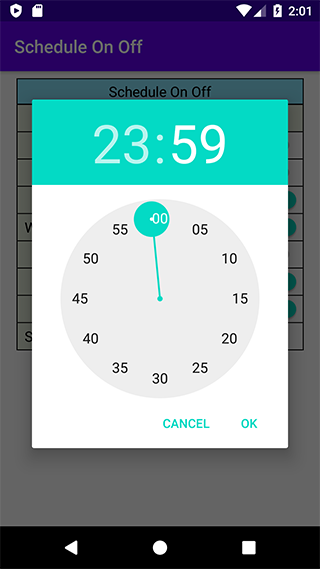

# Android MVVM Sample & Practice

**A MVVM architecture sample in Kotlin using [Architecture Components](https://developer.android.com/arch):**

- Room
- ViewModel
- LiveData
- Databinding
- Navigation & SafeArgs
- Lifecycle-aware components

**Extra libraries:**

- [Koin](https://github.com/InsertKoinIO/koin) (Dependency Injection for Kotlin)
- [Timber](https://github.com/JakeWharton/timber) (A Logger library)

**Screenshots:**

**About**

- A demo app to do something weekly (i.e. Turn on/off something).
- Each day of the week has two times: start time and end time.
- It will not trigger if start time is equals to end time.
